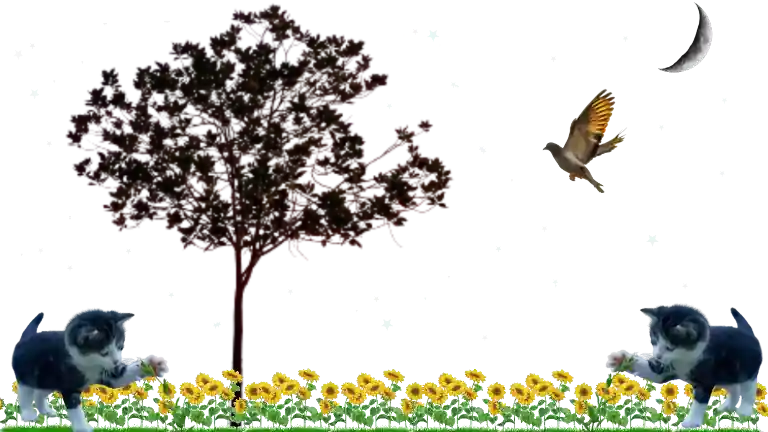

<!--Hi, I do **Software Engineering**. Besides that, my primary areas of interest are **artificial intelligence** and **cyber security**. 

I am passionate about creating innovative and effective software solutions that solve real-world problems.
My areas of interest are AI and cyber security.I strongly support **open-source development** and believe 
in the power of **collaboration and community**. On my Github profile, you can find my latest projects
and contributions, where I strive to make a meaningful impact in the field of technology and problem-solving.

## Contact

:email: Email: `ssujj at protonmail dot com`  
:pen: Twitter: [twitter.com/ssujaudd1n](https://twitter.com/ssujaudd1n)
-->
```json
{
    "name": "Sujauddin",
    "web": "https://sujauddin.me",
    "profession": "Software Engineer",
    "interests": [
        "Artificial Intelligence",
        "Cybersecurity"
    ]
}
```
<!--
||||||
|-|-|-|-|-|
||||||
-->

